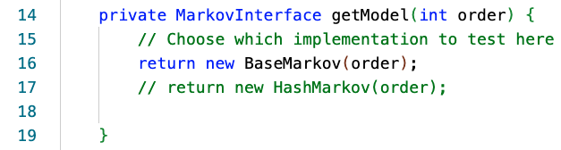

# Project 2: Markov, Fall 2023

This is the directions document for Project P2 Markov in CompSci 201 at Duke University, Fall 2023.

See [the details document](docs/details.md) for information on using Git, starting the project, and more details about the project including information about the classes and concepts that are outlined briefly below. You'll absolutely need to read the information in the [details document](docs/details.md) to understand how the classes in this project work independently and together.

## Outline

- [Introduction](#introduction)
  - [What is a WordGram?](#what-is-a-wordgram)
  - [What is a Markov Model?](#what-is-a-markov-model)
- [Running Driver Code](#running-driver-code)
- [JUnit Tests](#junit-tests)
- [Coding Part 1: Developing the WordGram Class](#coding-part-1-developing-the-wordgram-class)
- [Coding Part 2: Developing the HashMarkov Class](#coding-part-2-developing-the-hashmarkov-class)
- [Analysis Questions](#analysis-questions)
- [Submitting and Grading](#submitting-and-grading)


## Introduction

Random Markov processes are widely used in Computer Science and in analyzing different forms of data. This project offers an occasionally amusing look at a *generative model* for creating realistic looking text in a data-driven way. To do so, you will implement two classes: First `WordGram` which represents immutable sequences of words, then `HashMarkov` which will be an efficient model for generating random text that uses `WordGram`s and `HashMap`s.

Generative models of the sort you will build are of great interest to researchers in artificial intelligence and machine learning generally, and especially those in the field of *natural language processing* (the use of algorithmic and statistical AI/ML techniques on human language). One recent and powerful example of such text-generation model via statistical machine learning program is the [OpenAI GPT project](https://openai.com/blog/chatgpt).

<details>
<summary>Historical details of this assignment (optional)</summary>

This assignment has its roots in several places: a story named _Inflexible Logic_ now found in pages 91-98 from [_Fantasia Mathematica (Google Books)_](http://books.google.com/books?id=9Xw8tMEmXncC&printsec=frontcover&pritnsec=frontcover#PPA91,M1) and reprinted from a 1940 New Yorker story called by Russell Maloney. 
The true mathematical roots are from a 1948 monolog by Claude Shannon, [A Mathematical Theory of Communication](https://docs.google.com/viewer?a=v&pid=sites&srcid=ZGVmYXVsdGRvbWFpbnxtaWNyb3JlYWRpbmcxMmZhbGx8Z3g6MThkYzkwNzcyY2U5M2U5Ng) which discusses in detail the mathematics and intuition behind this assignment. This assignment has its roots in a Nifty Assignment designed by Joe Zachary from U. Utah, assignments from Princeton designed by Kevin Wayne and others, and the work done at Duke starting with Owen Astrachan and continuing with Jeff Forbes, Salman Azhar, Branodn Fain, and the UTAs from Compsci 201.
</details>

## General Work for this project

Your goal is to create a more efficient Markov-Generating program/class than the provided `BaseMarkov` class. As you'll see below, you'll call this new class `HashMarkov` and it will generate the same random text as `BaseMarkov`, but it will generate that text much more efficiently. You will be able to run `BaseMarkov` only after you've implemented the `WordGram` class completely. So that's the first step in creating `HashMarkov`.

You're given several classes to test the `WordGram` class you'll develop. It's likely that when you've developed the `WordGram` class and it passes all tests that you'll be able to run `BaseMarkov` to see random text generated. Then you'll be able to develop the more efficient `HashMarkov` class.


## What is a `WordGram`

You will implement a class called `WordGram` that represents a sequence of words (represented as strings), just like a Java String represents a sequence of characters. Just as the Java String class is an immutable sequence of characters, the `WordGram` class you implement will be an immutable sequence of strings. Immutable means that once a WordGram object has been created, it cannot be modified. You cannot change the contents of a `WordGram` object. However, you can create a new WordGram from an existing `WordGram`.

For details about the `WordGram` class and the concepts in it, see the [details document](docs/details.md) -- the explanation below assumes you have a *very good* understanding of the `WordGram` class.

## Running Driver Code

The primary driver code for this assignment is located in `MarkovDriver.java`. You should be able to run the `public static void main` method of `MarkovDriver` immediately after cloning the starter code, and should see something like the output shown in the expandable section below (noting that your exact runtimes will likely be different / machine dependent). Note that *there is no random text generated* because you must implement `WordGram` before the code in `BaseMarkov` works.

<details><summary>Expand for example output of MarkovDriver with starter code</summary>

```

Trained on text in data/alice.txt with T=28196 words
Training time = 0.011 s
Generated N=100 random words with order 2 Markov Model
Generating time = 0.002 s
----------------------------------
 
----------------------------------
```

</details>

This initial output is blank now because the `WordGram` class is not correctly implemented; that will be your first coding task. Before starting to code however, you are encouraged to inspect `MarkovDriver` a little more closely to understand what it is doing. You will find details about the `MarkovDriver` class in the class and its comments as well 
as in the [details document](docs/details.md) that is part of this project.


## JUnit Tests

To help test your `WordGram` and `HashMarkov` implementations, you are given some *unit tests* in `WordGramTest.java` and `MarkovTest.java`, both located in the `src` folder. A unit test specifies a given input and asserts an expected outcome of running a method, then runs your code to confirm that the expected outcome occurs. You can see the exact tests inside of the two files. the JUnit library used by these testing classes is a very widely-used industry standard for unit testing.

Note that by default (to avoid compiler errors in the starter code), `MarkovTest` is testing the `BaseMarkov` implementation. When you are ready to test your `HashMarkov` implementation, you will want to change which model is created in the `getModel` method of `MarkovTest` at the position shown in the screenshow below (if the image does not render for you, you can find them in the `figures` folder).

<details>
<summary>Expand here for a screenshot of getModel in MarkovTest</summary>

<div align="center">
  
</div>

</details>

In order **to run these tests** inside VS Code, click the [Test Explorer](https://code.visualstudio.com/docs/java/java-testing#_test-explorer) (beaker) icon on the left side of VS Code (it should be the lowest icon on the panel). You can expand the arrow for `p2-markov` and the default package to see two sets of tests: One for `MarkovTest` and another for `WordGramTest`. You can click the run triangle next to each test package to run the tests. See the screenshot example in the expandable section below. *Note that JUnit programs are run by the JUnit library and the beaker-icon, not be running them as Java programs.*

You can test all the tests in `WordGramTest` by hovering over that label in the _TestExplorer_ panel which is active when you click the Beaker-Icon, and is shown in the screenshot when you expand the image below. You can also run each individual unit test by hovering and clicking on each test's run triangle. The results of the tests are in the VSCode _TEST RESULTS_ panel, not in the other panels where output is shown. Deciphering error JUnit error messages is not always straightforward -- but when the tests pass? You'll get all green.

<details>
<summary>Expand here for screenshot running JUnit test in VS Code</summary>

<div align="center">
  
</div>

</details>

The main benefit of JUnit tests lies in their ability to examine isolated "units" of code — that is, to check correctness of a segment with minimal reliance on other relevant code and data. Additionally, the purpose of supplying these *local* (on your own machine) tests is to allow you to catch potential problems quickly without needing to rely on the (somewhat slower) Gradescope autograder until you are reasonably confident in your code. You do not have to use them for a grade.

<details>
<summary>Expand for optional JUnit details</summary>

We use a major Java library called [**JUnit**](https://junit.org/junit5/) (specifically version 5) for creating and running these unit tests. It is not part of the standard Java API, so we have supplied the requisite files `JAR` files (Java ARchive files) along with this project in a folder called `lib` (you don't need to do anything with this).   

</details>


## Coding Part 1: Developing the `WordGram` Class

Your first task is to develop the `WordGram` class itself. You're given an outline of `WordGram.java` with appropriate instance variables declared, as well as stub (not fully/correctly implemented) methods.

Your task will be to implement these methods in `WordGram` according to the specifications provided. Javadocs in the starter code detail the expected behavior of all methods. For `hashCode`, `equals`, and `toString`, your implementations should conform to the specifications as given in the [documentation for `Object`](https://docs.oracle.com/en/java/javase/17/docs/api/java.base/java/lang/Object.html). 

Note that `WordGram` objects are *immutable*, meaning they should not change after creation (similar to Java Strings). Therefore, none of the methods except the constructor should *mutate* (or change) the words assosciated with a `WordGram` object.

For details on the constructor and methods of the `WordGram` class see the comments in the class you're given when you clone the project and the detailed descriptions in the [details document](docs/details.md).

After implementing the `WordGram` class, you should run the `WordGramTest` [JUnit tests](#junit-tests) to verify that your implementation is correct.

After correctly implementing the `WordGram` class, re-run the `MarkovDriver`. With the default values (`TEXT_SIZE = 100`, `RANDOM_SEED = 1234`, `MODEL_ORDER = 2`, `PRINT_MODE = true`, and `filename = "data/alice.txt"`) you should see different output than when you first ran the starter code, something like what is shown in the expandable section below.

<details><summary>Expand for example output of MarkovDriver with correct WordGram</summary>

```
Trained on text in data/alice.txt with T=28196 words
Training time = 0.012 s
Generated N=100 random words with order 2 Markov Model
Generating time = 0.060 s
----------------------------------
Alice; `I daresay it's a set of verses.' `Are they in the distance, and she swam 
about, trying to touch her. `Poor little thing!' said Alice, `a great girl like you,' 
(she might well say this), `to go on with the Dutchess, it had made. `He took me 
for a few minutes to see a little worried. `Just about as it turned a corner, `Oh 
my ears and whiskers, how late it's getting!' She was close behind it was growing, 
and very neatly and simply arranged; the only one who had got its head to keep back 
the wandering hair
```

</details>

Note in particular how the phrases/sentences seem better connected than what resulted from the starter code. As you will see when inspecting `BaseMarkov`, if it cannot find a given `WordGram` to calculate possible following words, it stops generating text. Before, with an incorrect constructor, `equals()`, etc., the original starter message was just random words from *Alice in Wonderland*. Now with a correct `WordGram` class, `BaseMarkov` is generating output from the Markov model described in the intro section of the [details document](docs/details.md).

*Caution*: Seeing the output shown above does not necessarily mean that every method of your `WordGram` class is correct. In particular, `BaseMarkov` does not use hashing, and so the `hashCode()` method does not impact it, but you should correctly implement *all* methods of `WordGram` before proceeding to the next part.


## Coding Part 2: Developing the HashMarkov Class

In this part you will develop a Markov model for generating random text using `WordGram`s and hashing. In particular, you should create a new `HashMarkov.java` file with a single public `HashMarkov` class that implements the `MarkovInterface`. 

Your implementation should have the same behavior as `BaseMarkov` in terms of implementing the interface methods and generating the same output, but it will have different performance properties due to the use of a `HashMap` in training. In particular, `HashMarkov` should create an instance variable `HashMap` that maps `WordGram`s of a given order to `List`s of words that follow that `WordGram`. The code below shows how you can do this, but the call of `new` should be in the constructor of the class, initializing the instance variable `myMap` you'll need to define.

```
HashMap<WordGram, List<String>> myMap = new HashMap<>();
```

The training text should be read (looped over) *exactly once* as the `setTraining()` method executes to create `myMap`. As a result, the `getFollows()` method should simply return the corresponding `List` from the map (or an empty `List` if there is no entry in the map), and this should be used in `getRandomText()` *This means your code avoids having to search the training text again for every random word generated*, leading to signficant efficiency 
in the `getRandomText` method.

You can and should use `BaseMarkov` as an example for how to implement the `MarkovInterface`, noting in particular that you *must* override and implement the interface methods. *See details of `getRandomText` method*, and the other methods and class in the [details document](docs/details.md). In particular, note that `getRandomText`, and the helper method it calls, `getNextWord` look eerily similar in `BaseMarkov` and `HashMarkov` as described in 
the [details document](docs/details.md).

### Running and Testing HashMarkov

The `MarkovDriver` sets a `RANDOM_SEED` to initialize the random number generator. You are welcome to change that value to experiment and play around with different random generations of text, but you should be sure to set it to 1234 for testing/submitting. Note that *if you use the same value for `RANDOM_SEED` you should get the same random text for `BaseMarkov` and `HashMarkov`*, if not, something is likely wrong with the implementation.

You can also test your `HashMarkov` class with the `MarkovTest` [JUnit tests](#junit-tests). Don't forget to edit the `getModel` method of `MarkovTest` to use a `HashMarkov` implementation when running your tests.

Note that JUnit tests and Gradescope tests will not check the efficiency of the `HashMarkov` implementation. Instead, you will need to rely on your conceptual understanding and empirical timing data which you can aquire by running `MarkovDriver` using a `HashMarkov` implementation. You will be asked to reason about both in the Analysis section.

Once you are confident that your `HashMarkov` code is correct, you are ready to submit to Gradescope and then move on to the analysis questions.


## Analysis Questions

Answer the following questions in your analysis. You'll submit your analysis as a separate PDF as a separate assignment to Gradescope. Answering these questions will require you to run the driver code to generate timing data and to reason about the algorithms and data structures you have implemented.

### Working Together for Analysis

You're *stronlgy encouraged* to work with others in 201 in completing the analysis section for this project. In future projects you'll work on an entire project in pairs, and submit once for the pair. For this project, however, each person should submit independently. If you actively work with one or more people in 201, *please make sure* you list each other in the analysis document you turn in.

### Big-O/O-notation for analysis questions

For the analysis, let $`N`$ denote the length/number of words of the random text being generated. Let $`T`$ denote the length/number of words of the training text. Assume that *all words are of at most a constant length* (say, no more than 35 characters). To help in using the files in the `data` folder, here are is some information about total number of words and number of different words in some of the files:

|file    |# different words| # total words|
|--------|---------------|--------------|
|alice.txt| 5,910 | 28,196 |
|hawthorne.txt| 14,123| 85,753|
|kjv10.txt| 34,027 | 823,135|
|littlebrother.txt|18,304| 119,986|
|melville.txt| 4,256 | 14,353|
|romeo.txt| 6,394 | 25,788 |
| shakespeare.txt | 67,505 | 901,325|

### Question 1

What is the asymptotic (big O) runtime complexity of each of the methods: `setTraining()` `getRandomText()` for the `BaseMarkov` impelementation in terms of $`N`$ and $`T`$? State your answers, and justify them in *both* of the following ways.

- *Theory*. Explain why you expect `setTraining()` and `getRandomText()` for `BaseMarkov` to have the stated runtime complexity by referencing the algorithms/data structures/code used. Explain the complexity of each operation/method, accounting for any looping, in the code. You may assume that `nextInt` is a constant time operation to generate a random number and `split()` has runtime complexity $`O(T)`$ when called on the training text.
- *Experiment*. Run the main method of `MarkovDriver` with *at least* 3 different data files of varying sizes $`T`$ (it is fine to use `alice.txt` for one of them). For each, run the main method with *at least* 3 different values of `TEXT_SIZE` (which corresponds to $`N`$). So you should have a total of at least 9 data points; use these to fill out a table like the one shown below. *Explain how your empirical data does or does not conform to your expectations for the runtime complexity of `getRandomText()`.*

| Data file    | $`T`$    | $`N`$    | Training Time (s)    | Generating time (s)    |
| ------------ | -------- | -------- | -------------------- | ---------------------- |
| alice.txt    | 28,196   | 100      | 0.012                | 0.060                  |
| ...          | ....     | ...      | ...                  | ...                    |

*Suggestions*: You will likely get the clearest data if you include very different values for $`T`$ and $`N`$, and preferably larger values -- see the table of sizes above to help you choose text files you'll use. You can set $`N`$ directly to much larger values by changing `TEXT_SIZE`, for example to 1,000 or 10,000. When doing so, you can set `PRINT_MODE` to `false` in `MarkovDriver` to avoid having a large amount of text printed to your terminal. Note that `BaseMarkov` is not necessarily an efficient implementation, so it may take a long time to run with large $`T`$ and $`N`$. You do not need to run anything for multiple minutes just for data collection for this assignment.  

### Question 2

Same as Question 1, but for `HashMarkov` instead of `BaseMarkov`: What is the asymptotic (big O) runtime complexity of the methods: `setTraining()` and `getRandomText()` for the `HashMarkov` impelementation in terms of $`N`$ and $`T`$? State your answers, and justify them in *theory and experiment* exactly as you did for Question 1. 

You can use the same training texts and values for $`N`$ as you chose in question 1, with the same suggestions mentioned there. Note that, implemented correctly, `HashMarkov` should be noticably more efficient at generating random text than `BaseMarkov`, and this should be evident in your analysis.

### Question 3

Markov models like the one you implemented in this project are one example of a larger research area in artificial intelligence (AI) and machine learning (ML) called *generative models* for *natural language processing*. Currently, one of the state-of-the-art models is called *GPT*, created by [OpenAI](https://openai.com/about/). OpenAI states that their "mission is to ensure that artificial general intelligence (AGI)—...highly autonomous systems that outperform humans at most economically valuable work—benefits all of humanity." 

GPT is not, however, open-source, meaning that the underlying source code of the model is not freely available and the model is only accessible via API calls. Read this short article about open source code in artificial intelligence: Can’t Access GPT-3? Here’s GPT-J — Its Open-Source Cousin [accessible via this link](https://towardsdatascience.com/cant-access-gpt-3-here-s-gpt-j-its-open-source-cousin-8af86a638b11). 

Answer both of the following related questions:
- What do you think of OpenAI's stated mission? In particular, do you think that "highly autonomous systems that outperform humans at most economically valuable work" can benefit all of humanity? Why or why not?
- Do you think new research code in AI/ML should be more open source? Why, or why not? 

There is no right or wrong answer to either question; we are looking for one or two paragraphs of thoughtful reflection.


## Submitting and Grading
You will submit the assignment on Gradescope. You can access Gradescope through the tab on Sakai. Please take note that changes/commits on GitLab are NOT automatically synced to Gradescope. You are welcome to submit as many times as you like, only the most recent submission will count for a grade.

Don't forget to upload a PDF for the analysis part of this assignment and mark where you answer each question. This is a separate submission in Gradescope.

*Do not forget to record 20 minutes of your coding work*.

### Grading

| Section.  | points |
|-----------|--------|
| WordGram  | 8   |
| HashMarkov| 8   |
| Analysis  | 12  |
| Video | 2 |

